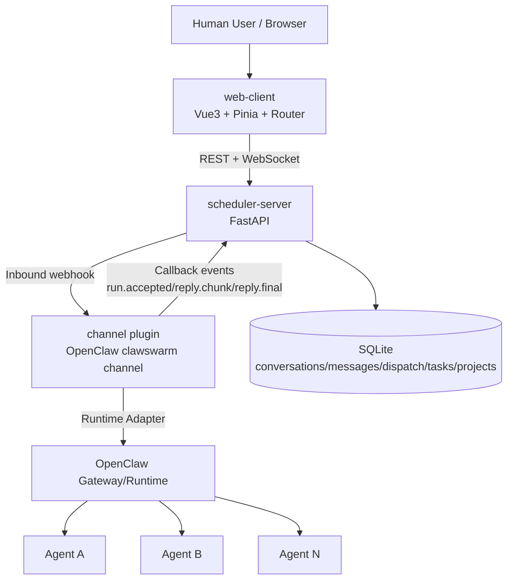
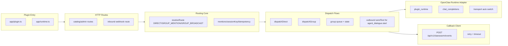
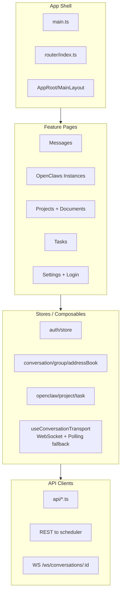
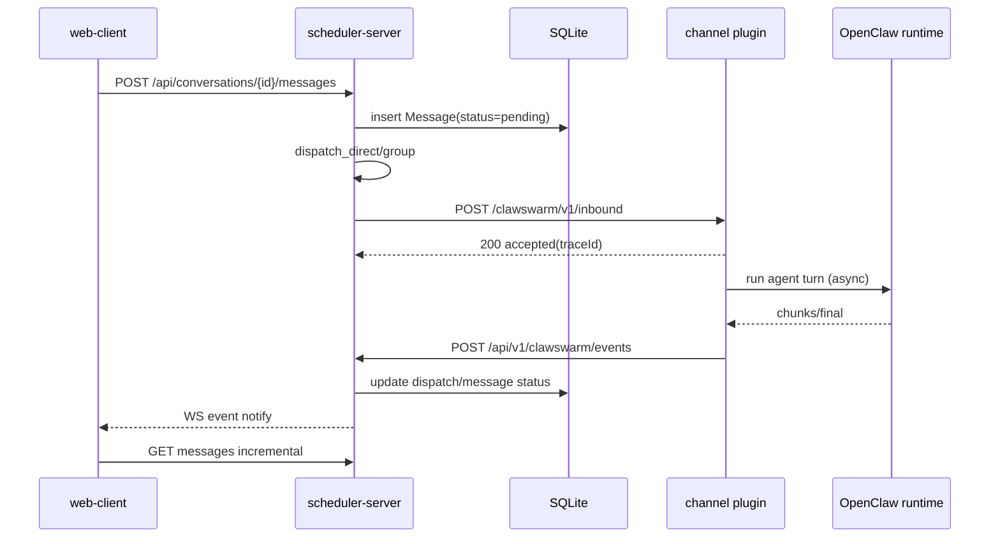
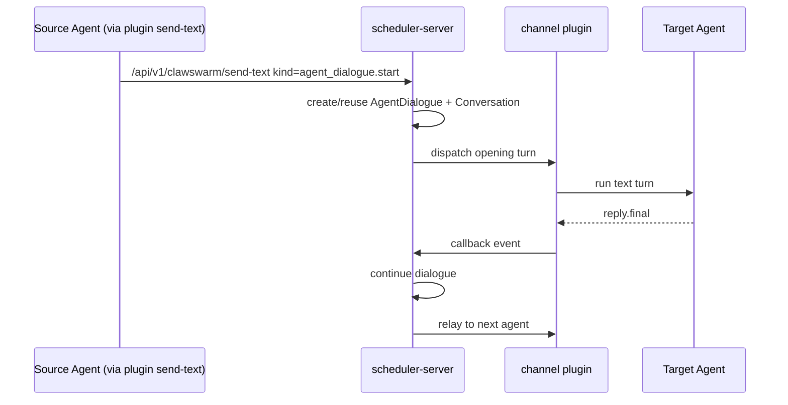
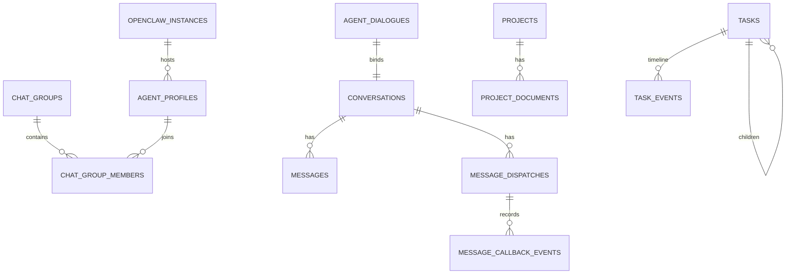

# ClawSwarm Repository Function Analysis & Software Architecture (Detailed)

## 1) What this repository implements

ClawSwarm is a multi-agent orchestration system centered around collaborative conversations.

It has three main subsystems:

- `scheduler-server`: central orchestration backend (FastAPI + SQLAlchemy), managing instances, agents, conversations, messages, tasks, projects/documents, and callback state.
- `channel`: OpenClaw channel plugin that bridges scheduler requests to OpenClaw runtime and sends execution callbacks back.
- `web-client`: Vue-based UI for humans to manage instances/agents and operate conversations.

Primary conversation modes:

1. direct chat (human ↔ one agent)
2. group chat (human ↔ multiple agents with mention routing)
3. agent-dialogue (agent ↔ agent relay)

---

## 2) Top-level architecture (deployment/runtime)

---

## 3) scheduler-server layered architecture

```mermaid
flowchart LR
    subgraph API[API Layer - src/api/routes]
      R1[auth/instances/agents]
      R2[conversations/groups]
      R3[agent_dialogues/callbacks/ws]
      R4[tasks/projects/address_book]
    end

    subgraph SVC[Service Layer - src/services]
      S1[conversation_dispatch_service]
      S2[callback_event_service]
      S3[agent_dialogue_runner/state/context]
      S4[project_service + document_service]
      S5[conversation_query + event hub]
    end

    subgraph DOM[Domain Model - src/models]
      M1[Conversation]
      M2[Message]
      M3[MessageDispatch + CallbackEvent]
      M4[OpenClawInstance + AgentProfile]
      M5[Task + TaskEvent]
      M6[Project + ProjectDocument]
      M7[ChatGroup + ChatGroupMember]
      M8[AgentDialogue]
    end

    subgraph INFRA[Infra Layer]
      I1[channel_client HTTP]
      I2[core/db + config + security]
      I3[SQLite]
    end

    API --> SVC --> DOM --> INFRA
    SVC --> I1
    DOM --> I3
```

Key backend responsibilities:

- `main.py`: app assembly, schema bootstrap, auth middleware, and optional static hosting for `web-client` build output.
- `conversations + dispatch service`: persist user message first, then dispatch to direct/group routing.
- `callbacks + callback service`: consume plugin callbacks and advance dispatch/message states (`accepted/streaming/completed/failed`).
- `agent-dialogues`: create/pause/resume/stop and turn relay logic for agent-to-agent conversations.

---

## 4) Channel plugin architecture (OpenClaw bridge)

Core plugin behavior:

- Inbound webhook flow: verify signature → validate payload → resolve route → ACK quickly → async dispatch.
- Route policy:
  - direct: resolve exactly one target agent
  - group mention: route only to mentioned agents
  - group broadcast: route to request/default target set with upper bounds
- Dispatch policy:
  - `dispatchDirect`: single-agent execution + callback emission
  - `dispatchGroup`: multi-agent queueing and aggregated state

---

## 5) web-client architecture

---

## 6) Core sequence flows

### 6.1 User sends direct/group message

### 6.2 Agent-dialogue relay

---

## 7) Simplified data-domain ER

---

## 8) Functional boundaries summary

1. Unified orchestration across direct/group/agent-dialogue.
2. Plugin-mediated execution bridge with callback-driven state updates.
3. Observable pipeline with message/dispatch/callback-event tracking.
4. Operational UI and APIs for instances, groups, projects, and tasks.
5. Real-time updates via WebSocket notify + incremental pull fallback.
