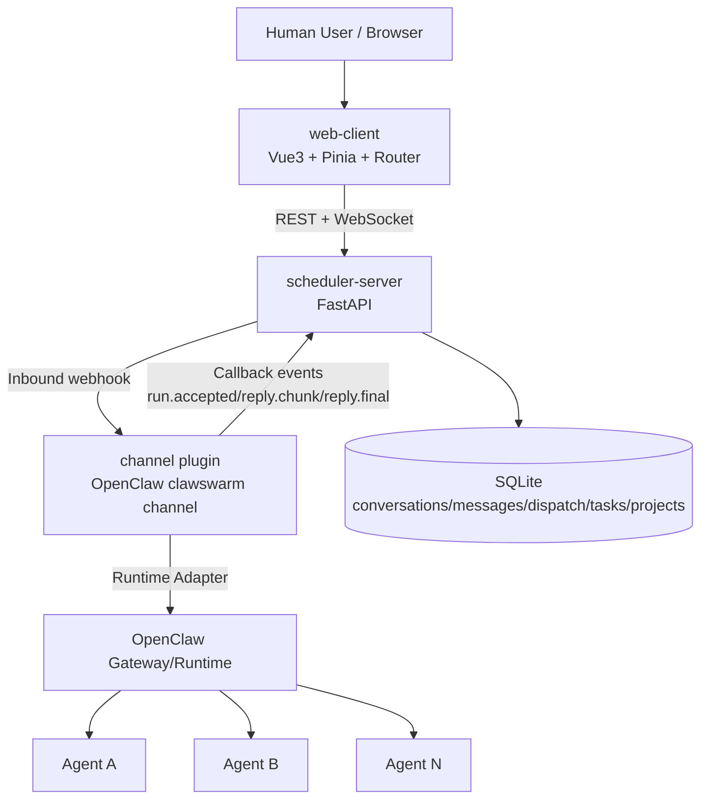
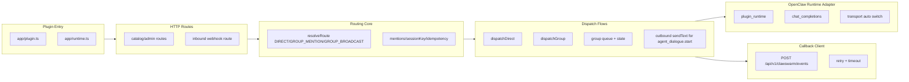
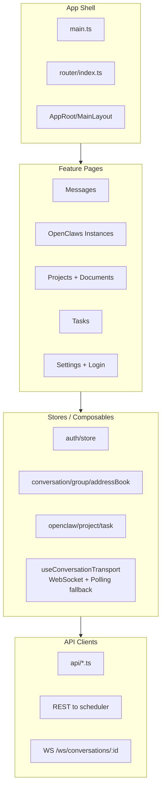
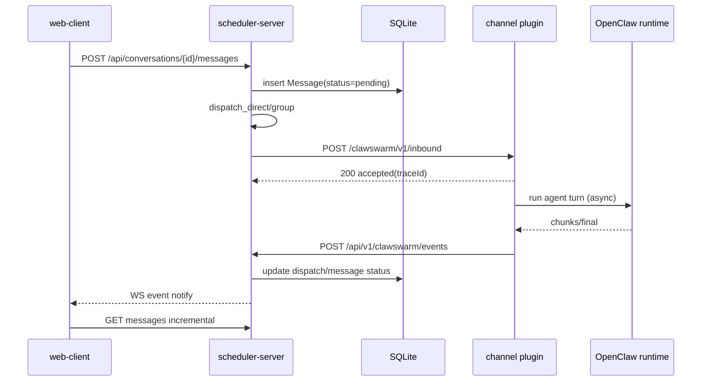
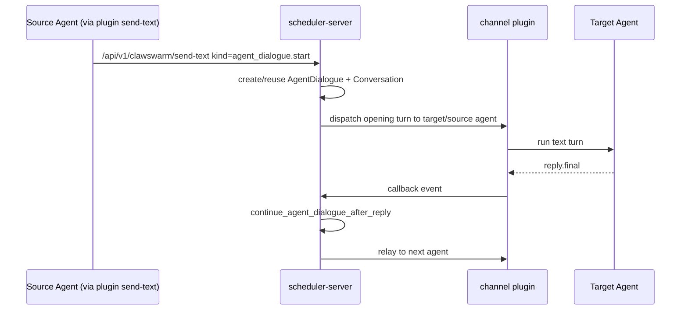
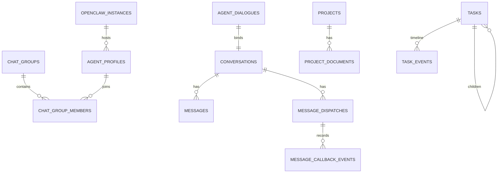

# ClawSwarm 仓库功能分析与软件结构图（详细版）

## 1. 仓库整体定位

ClawSwarm 是一个围绕 **多 Agent 协作会话** 设计的系统，核心由三部分组成：

- `scheduler-server`：调度中枢（FastAPI + SQLAlchemy），负责实例、Agent、会话、消息、任务、项目文档、回调状态。
- `channel`：OpenClaw 插件，负责把调度中心消息投递到 OpenClaw Agent，并把执行回调写回调度中心。
- `web-client`：面向人类用户（老板/管理员）的管理与会话 UI。

其核心目标是把传统单 agent 对话扩展为：

1) 单聊（human ↔ agent）
2) 群聊（human ↔ 多 agent，支持 @mention 路由）
3) agent-dialogue（agent ↔ agent 自动接力）

---

## 2. 顶层软件结构图（部署 + 运行视角）

---

## 3. scheduler-server 分层结构图（后端）

```mermaid
flowchart LR
    subgraph API[API Layer - src/api/routes]
      R1[auth/instances/agents]
      R2[conversations/groups]
      R3[agent_dialogues/callbacks/ws]
      R4[tasks/projects/address_book]
    end

    subgraph SVC[Service Layer - src/services]
      S1[conversation_dispatch_service]
      S2[callback_event_service]
      S3[agent_dialogue_runner/state/context]
      S4[project_service + document_service]
      S5[conversation_query + event hub]
    end

    subgraph DOM[Domain Model - src/models]
      M1[Conversation]
      M2[Message]
      M3[MessageDispatch + CallbackEvent]
      M4[OpenClawInstance + AgentProfile]
      M5[Task + TaskEvent]
      M6[Project + ProjectDocument]
      M7[ChatGroup + ChatGroupMember]
      M8[AgentDialogue]
    end

    subgraph INFRA[Infra Layer]
      I1[channel_client HTTP]
      I2[core/db + config + security]
      I3[SQLite]
    end

    API --> SVC --> DOM --> INFRA
    SVC --> I1
    DOM --> I3
```

### 后端关键职责

- `main.py` 统一挂载 API 路由、初始化表结构、默认用户、鉴权中间件、并可直接托管前端静态资源。  
- `conversations.py + conversation_dispatch_service.py` 负责“先落消息，再分发”的核心写路径（direct/group）。  
- `callbacks.py + callback_event_service.py` 负责把插件回调映射成 dispatch/message 状态机，支持 chunk/final/error。  
- `agent_dialogues` 路径负责 agent-to-agent 的生命周期（创建、暂停、恢复、停止、插话）。

---

## 4. channel 插件结构图（OpenClaw 侧桥接层）

### 插件核心逻辑

- 入站 `/clawswarm/v1/inbound`：验签 → JSON 校验 → 路由决策 → 先 ACK → 后台异步调度。
- 路由策略：
  - direct：必须定位单个 agent；
  - group mention：仅投递给被 @ 的 agent；
  - group broadcast：投递给目标列表/默认列表并受上限限制。
- 调度策略：
  - `dispatchDirect` 负责单 agent 的 accepted/chunk/final/error 回调闭环；
  - `dispatchGroup` 负责多 agent 并发排队并聚合状态。

---

## 5. web-client 结构图（前端）

### 前端核心特征

- 路由上明确区分公开页（登录）和主工作台页面。
- 会话传输层优先 WebSocket；失败后自动回退轮询，保证弱网环境仍可用。
- 功能面覆盖：消息、群聊、OpenClaw 实例、任务、项目文档。

---

## 6. 核心业务序列图（消息闭环）

### 6.1 用户发起 direct/group 消息

### 6.2 agent-dialogue（agent ↔ agent）

---

## 7. 数据域（简化 ER）

---

## 8. 功能边界总结

ClawSwarm 当前实现的能力可归纳为：

1. **多会话类型统一编排**：direct/group/agent_dialogue 共用消息与分发表。
2. **插件化执行桥接**：调度中心不直接跑 agent，而通过 OpenClaw channel 插件执行并回调。
3. **可观测状态机**：message + dispatch + callback_event 形成可追踪闭环。
4. **管理面完整度较高**：实例、Agent、群组、项目文档、任务等均有 API/UI。
5. **实时体验渐进增强**：WebSocket 通知 + HTTP 增量拉取 + polling fallback。

